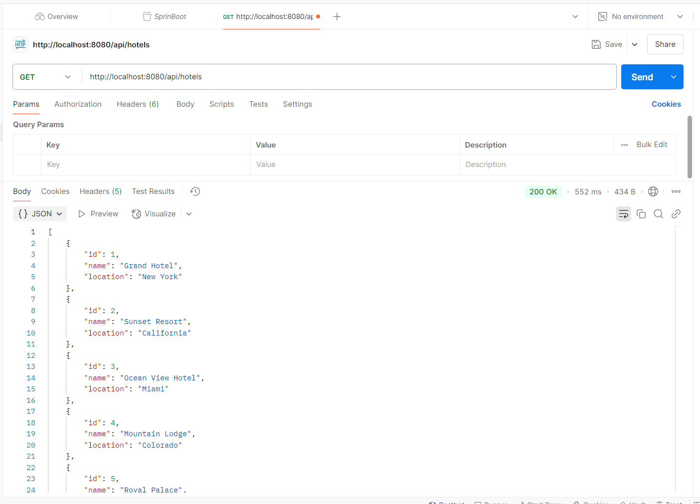
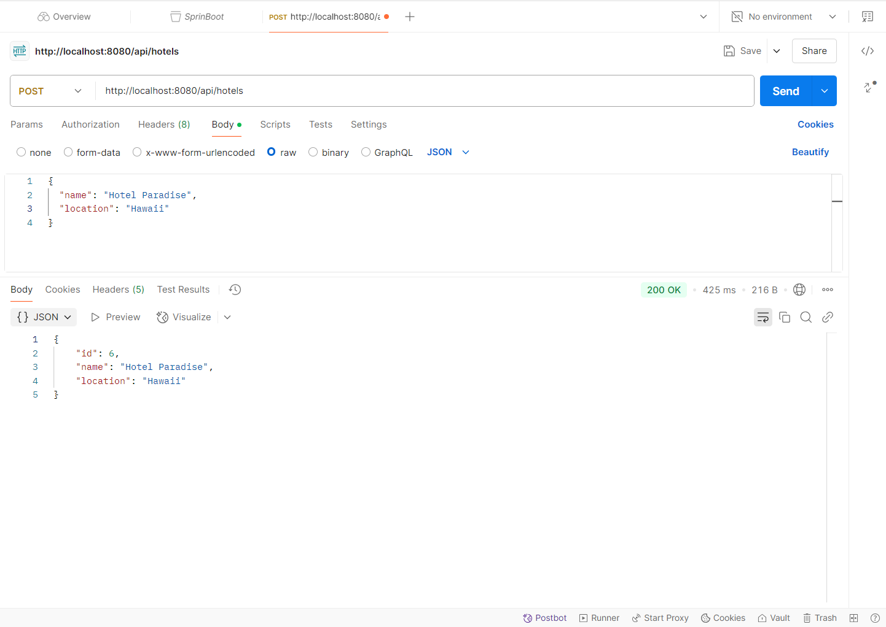

# Hotel API

This repository contains a Spring Boot application that exposes a REST API for managing hotel information. You can perform operations like retrieving and adding hotel records using the API.

## API Endpoints

### GET /api/hotels
Retrieves a list of all hotels.

#### Example Response:
```json
[
  {
    "id": 1,
    "name": "Hotel Paradise",
    "location": "Hawaii"
  },
  {
    "id": 2,
    "name": "Luxury Inn",
    "location": "Paris"
  }
]
```
### POST /api/hotels
Adds a new hotel.

#### Request:
```json
{
"name": "Hotel Paradise",
"location": "Hawaii"
}
```
#### Example Response:
```json
{
  "id": 3,
  "name": "Hotel Paradise",
  "location": "Hawaii"
}
```
## Screenshots
### GET /api/hotels Request
Below is a screenshot of the response for the `GET /api/hotels` request using Postman:


### POST /api/hotels Request
Below is a screenshot of the response for the `POST /api/hotels` request using Postman:



## Project Structure
```
Hotel
├── src
│   ├── main
│   │   ├── java
│   │   │   │   ├── com.example.hotel
│   │   │   │   │   ├── controller
│   │   │   │   │   │   └── HotelController.java
│   │   │   │   │   ├── service
│   │   │   │   │   │   └── HotelService.java
│   │   │   │   │   ├── HotelApplication.java
│   │   │   │   │   └── Hotel.java
│   │   ├── resources
│   │   │   └── application.properties
├── pom.xml
└── README.md
```

## Setup Instructions

### Prerequisites

1. **Java 17** or later
2. **Maven** to build and run the project.
3. **MySQL** for database persistence.

### Clone the Repository

To get started, clone the repository to your local machine:

```bash
git clone https://github.com/A00483108/Hotel.git
cd Hotel
```
### Run the Application
1. Make sure you have MySQL running locally and a database created (e.g., hotel_db).
2. Edit the application.properties file located in src/main/resources to configure your MySQL connection:
    ```bash
    spring.datasource.url=jdbc:mysql://localhost:3306/hotel_db
    spring.datasource.username=root
    spring.datasource.password=your-password
    spring.jpa.hibernate.ddl-auto=update
    spring.jpa.show-sql=true
    ```
3. Build and run the application using Maven:
    ```bash
   mvn spring-boot:run
   ```
The application will run on http://localhost:8080.


### Developed By
Sukanta Dey Amit